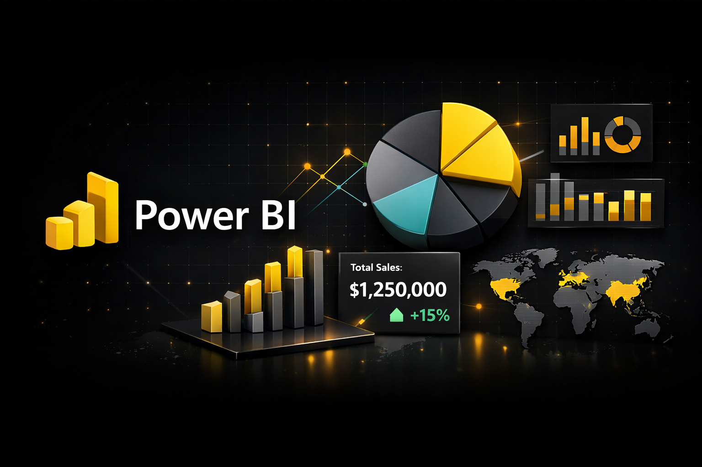

  

# 📊 Power_BI_Portfolio
A collection of Power BI dashboards built to explore data, analyze real-world business problems, answer key business questions, and turn insights into informed decisions.
The focus of this portfolio is not just on creating visuals, but on **using data to understand problems, identify patterns, and support business decision-making**.

---

## 👨‍💻 About This Repository
This repository serves as a centralized place for all my Power BI projects.  
Each dashboard is designed end-to-end — from understanding the problem statement to analyzing data and presenting insights in a clear and interactive manner.

Every project includes:
- A Power BI dashboard (`.pbix`)
- Dataset or data source details
- Dashboard screenshots
- Clear documentation explaining the analysis and insights

---

## 🛠 Tools & Skills Used
- **Power BI** (Data Modeling, DAX, Interactive Dashboards)
- **SQL** (Data extraction, transformation, analysis)
- **Excel** (Data cleaning and preparation)
- **Data Analysis & Business Intelligence**

---

## 📁 Projects Included

### 🎬 Netflix Dashboard
An analytical dashboard focused on understanding Netflix content distribution and trends.
- Content split between Movies and TV Shows
- Genre-wise and rating-wise analysis
- Release year trends and content growth insights

---

### 🛒 Mega Store Dashboard
A business-focused dashboard analyzing sales performance across different dimensions.
- Sales and profit analysis
- Category and regional performance
- Identification of high- and low-performing segments

---

### 🏬 Super Store Sales Dashboard
A detailed sales analytics dashboard designed to evaluate overall store performance.
- Sales, profit, and discount analysis
- Customer and product-level insights
- Trend analysis to support strategic decisions

---

## 🎯 Purpose of This Portfolio
The goal of this portfolio is to demonstrate:
- How data can be translated into insights
- How dashboards can support business decisions
- A structured and analytical approach to problem-solving using Power BI

If you are a recruiter, hiring manager, or data enthusiast, feel free to explore the projects and review the insights.

---

📌 *Each project is organized in its own folder. Navigate through the repository to explore individual dashboards and their documentation.*
